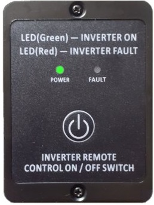
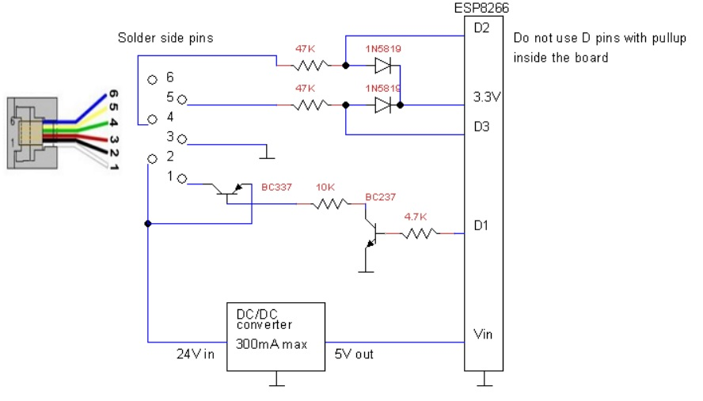
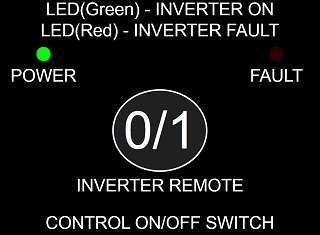

# alcapower_remote
Alcapower remote con ESP8266

Il comando remoto è come quello in foto:

Ci sono 2 modelli: 12V e 24V. Io ho il 24V collegato all'inverter.
In parallelo ai fili del comando remoto originale ho collegato un ESP8266 in questo modo:

Caricando lo sketch nell'ESP8266 si apre una pagina come questa:

Premendo il pulsante rotondo si simula la pressione del tasto del comando remoto.
